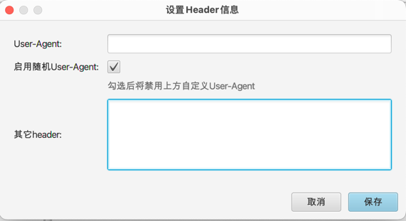

# Vuleye 使用手册

## 代理
1.可以配置自定义代理，防止被溯源，或者用于编写poc时抓包分析。

## User-Agent
1.第一行为设置自定义的User-Agent
2.复选框为启用随机UA,这个UA字典在配置文件中，当启用该功能后上面的配置就不会生效了。
3.其它header用于设置其它一些特殊的头字段，包括Cookie。

## DNSLog
1.目前仅支持Ceye DNSLog：
[ceye官网](http://ceye.io)

2.如果漏洞检测需要依赖Dnslog,可在插入域名处使用$$DNSLOG$$标记:

3.效果图：

## POC编写
1.待计划中的功能基本开发差不多了再写POC编写的注意事项。

## 注意事项
1.config.properties中的配置项不要删除。
2.pocs目录下的json文件主要是为了测试方便才编写的，有些内容和实际poc有出入，使用时需要自行编写，后面可能会不定期更新一些自己写的。